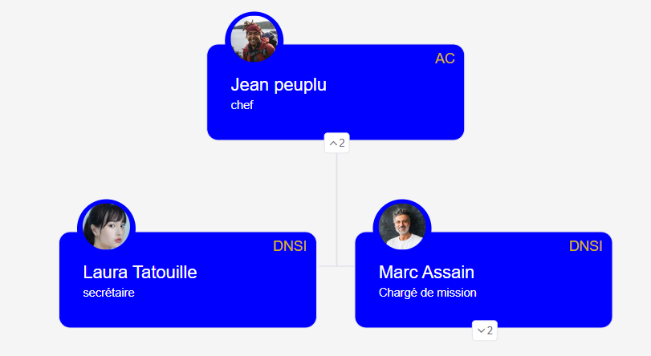
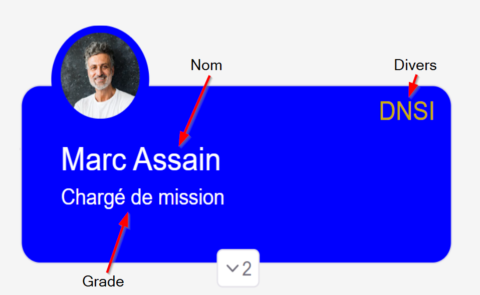

# Jtaorgchart

# Description
This plugin allows displaying a hierarchical chart based on a data source.



# Usage

- Menu
  - **Horizontal/Compact**: change chart display
  - **Save** : Save orgChart (png)
  - **Filter** : Filter orgChart : keeps the selected card and its children (Only if "**Click + select**" is selected)
  - **Search**: A field allows entering all or part of a name. The corresponding cards will appear.

- **Mouse wheel**: zoom in/out
- **Click + drag**: moves the chart within the window
- **Click on the card**: Triggers the "**Click on card**" onclick event
- **Click on "/\\" or "\\/" button**: Shows/hides the children of the card

# Configuration

| Parameter           | Description                                              |
| :------------------ | :------------------------------------------------------- |
| **Initial Zoom**    | Initial zoom level for displaying the chart. Default is 1 |
| **Click + select**  | true to visually identify the selected card and center it in the window |
| **Click on card**   | The "Onclick" event allows accessing the record corresponding to the card (jtaOrgchart.card) |
| **Dataprovider**    | The data source. (_Required_)                            |
| **id**              | The field corresponding to the card's ID. (_Required_)    |
| **ParentId**        | The field corresponding to the card's parent ID. (_Required_) The "root" card will be the one without a parent (empty field) |
| **Name**            | The field corresponding to the name. (_Required_)         |
| **Grade**           | The field corresponding to the grade. (_Required_)        |
| **Miscellaneous**   | The "miscellaneous" field. (_Required_)                  |
| **With image**      | true to display an image associated with the card         |
| **Image**           | The field containing the image. Must be of type **"Attachments"**. The retained image is the first one found in this field. If no image is found, it will be replaced by a generic icon |
| **Background color, name color, grade color, miscellaneous field color** | The colors to use |



## Instructions

To build your new  plugin run the following in your Budibase CLI:
```
budi plugins --build
```

You can also re-build everytime you make a change to your plugin with the command:
```
budi plugins --watch
```
<hr>

Find out more about [Budibase](https://github.com/Budibase/budibase).

